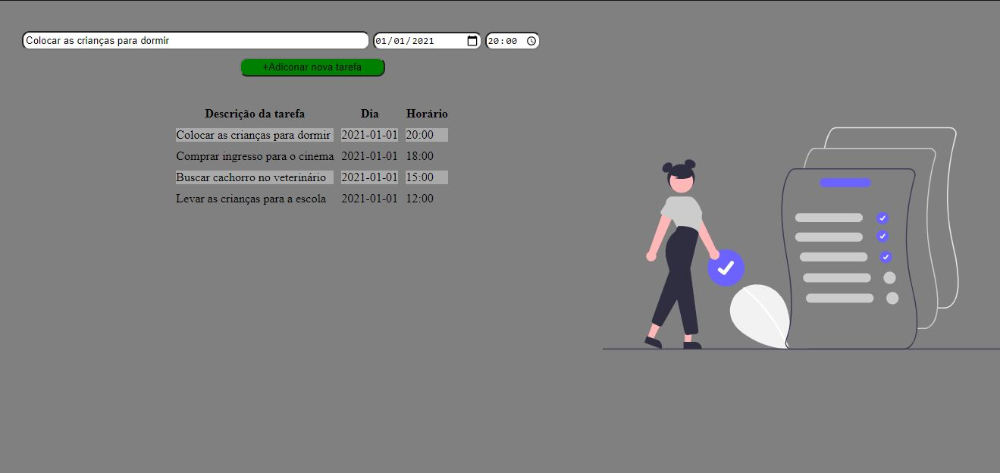

# ToDo-List
Uma ToDo List simples para efeitos de estudos. 

Tecnologias usadas: HTML, CSS e Javascript

OBS: Ainda não implementada a funcionalidade de exclusão de tarefas (ou tarefas concluídas)

Página única.

A aplicação não permite inserir tarefas com algum campo não preenchido (descrição da tarefa, dia ou horário).

Para ir à aplicação, acesse:
https://gustas01.github.io/ToDo-List/
